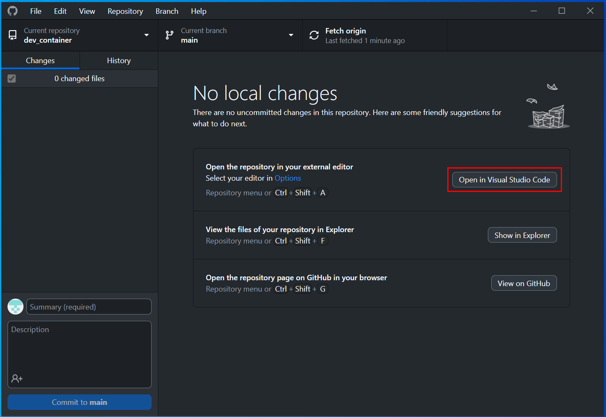

# Educational Development Environment

This repository contains the files, libraries and applications for a base development environment.

You'll set up this environment and use it to build and publish a personal website using Github's
free website hosting features. By the end, you'll be comfortable with the basic workflows around
software development and basic HTML/CSS.

There's a lot to learn here, and lots of questions to ask. What's in this document is just an overview 
introduction, and mostly steps on setting up your computer with everything you need to write code
and develop web applications. Try to run through the steps to set everything up, keeping track of questions
as you go. Don't worry too much about understanding and knowing it all, but for some of the terms and
concepts mentioned here you can refer to the [glossary](docs/Glossary.md).

Once set up, we can use that as a base to learn some of the foundations of computing and review each
of these steps more deeply to explain what's actually going on.

## Technical Introduction ## 
With this project, you'll be installing a code editor, creating a virtual server using Docker to act
as the host for your  website, familliarizing yourself with version control, and using GitHub to
publish your resume/site. This [repository](docs/Glossary.md#code-repository) contains the files, 
libraries and applications for a base development environment to work in.

The main focus of this repository is on bulding core development practices like testing before 
publishing, using [version control](docs/Glossary.md#version-control) to keep track of code changes, 
managing [containers](docs/Glossary.md#container), and interacting with the [command line console](docs/Glossary.md#command-line-console). A skeleton for a simple website has been provided
to build these practices while also creating an online resume to learn basic HTML and CSS.

The environment uses [Docker](docs/Glossary.md#docker), which is a platform that allows for easy 
management of [virtual servers](docs/Glossary.md#virtualization). While this setup is more complicated 
to start out with, putting the heavy lifting early will help build a better foundation to work off of
with more complex projects later. Also, a setup like this is very common for developers so getting
familliar with it is important for anyone working as a developer.

## Setting Up the Environment ##

You'll need 3 things first: a code editor, Docker Desktop, and the Github application. Keep track
of any questions as you go. There's going to be a lot of stuff here, which is easier to explain
once the environment is built. Really, all you need to know is that this will install and set up
everything you need to work on software projects.

### 1. Install  a Code Editor ###
Download a code editor such as [Visual Studio Code](https://code.visualstudio.com/download). Visual Studio 
Code is the preferable editor for this, but ultimately what's important is using what you're comfortable with.

### 2. Install Docker and Docker Desktop ###

[Docker Desktop](docs/Glossary.md#docker) provides an interface to see and manage the [virtual servers](docs/Glossary.md#virtualization) running on your computer. Installing it also installs the Docker engine, which is 
the underlying system that provides the technology for the virtual servers to run on.

Download Docker Desktop from https://www.docker.com/products/docker-desktop/
 
**Installing on Mac:**

Double-click Docker.dmg to open the installer, then drag the Docker icon to the Applications folder. You 
can then open Docker Desktop like any other app.

**Installing on Windows:**

You'll need to first install the Windows Subsystem for Linux. This provides an adaptation layer that 
mimics Linux and provides the neccesary systems for Docker to work with Windows.

In Visual Studio Code, go to the "Terminal" menu and choose "New Terminal" which will open a command 
line prompt in the editor. This is the [command line console](docs/Glossary.md#command-line-console),
which is text-based program that allows developers a more powerful way of interacting with
computers. It takes commands that are typed in the prompt and runs them, showing the output of
the command as more text.

This video shows how to open the terminal in Visual Studio Code and a sample command that echoes some
text back as output.

https://github.com/passthefist/dev_container/assets/279303/5d6b5700-6b97-491e-99dc-1e444d2579fa

Type `wsl --update` and hit enter to run the command that will install software needed to run Docker on
Windows. You should see some output that finishes with a successful update/installation or that the most
recent version is already installed. You'll then need to log out and log back in. After logging in, 
you'll be able to start the Docker Desktop app.

### 3. Github Desktop App ###

We'll come back to Git, Github, and version control in general but you can reference [this page](docs/Git_Intro.md) for more after everything is set up.

The Github Desktop App provides an easier to use interface to [Git](docs/Glossary.md#version-control),
which is the most popular solution for keeping track of code changes in [version control](docs/Glossary.md#version-control).

Developers use version control to save code in a more structured way than just saving the file as normal.
With Git, you can periodically commit your changes to keep a log of different versions of the files that
have been changed. If a bug is later discovered or a file is accidentally removed, the previous version
can be recovered (hence calling these "version control"). Git supports many features, and the Github app
makes using it easier. Different projects can have their own code repositories, allowing developers to
separate or share the code they're working on to coordinate their projects. [Github](docs/Glossary.md#github) 
is a site that hosts these projects for developers to manage using Git.

Download the Github Desktop app from https://desktop.github.com/. Once installed, you'll need to log in
to the app to access your Github projects in the app.

### 4. Download This Project's Code (Repository) ###

Once all the applications are installed and you've logged in to the Github app, you can download
the code to your computer. Scroll back to the top of this page (or go to https://github.com/passthefist/
dev_container) if you're not on it. Click the "Fork" button to create a copy of this project for your
Github account. It will take you to a prompt, where you can choose your user in the "Owner" dropdown
and just keep the defaults for the rest. Clicking the "Create Fork" button will create your own version 
of this project owned by your account. You can follow this video as an example.

https://github.com/passthefist/dev_container/assets/279303/49af98d3-ad88-4518-ba97-e96030523aec

Then, in the upper left corner of the Github Desktop app, you can search for your repositories. Choose 
this one (it should be called "dev_container") to create a copy of the repository to work with locally.
This is called "cloning", a term you'll see while in the Github Desktop App or Github Website.

https://github.com/passthefist/dev_container/assets/279303/99ec12f5-b2a5-4763-bc85-d99a23aabf25

You should then see this screen once it's done, and you can open the files in your code editor by clicking 
this button. Once the full environment is set up, you'll be able to use Git to save your changes. 



### 5. Start the Docker Container and Webserver ###

The easiest way to do this is using the command line in Visual Studio Code. If you're on Windows, you
already did this as part of installing Docker. If not, you can open the it from the Terminal menu.

This video shows how to open the terminal in Visual Studio Code and a sample command that echoes some
text back as output.

https://github.com/passthefist/dev_container/assets/279303/5c6051e5-3922-4e1b-8459-95320c8f74eb

This is the [command line console](docs/Glossary.md#command-line-console), which is a more direct and 
powerful interface to the [operating system](docs/Glossary.md#operating-sytem) than the graphical
desktop environment. It takes a command typed on the prompt line, executing it once a user hits enter.
Here, we'll be using it to build and run our Docker container with the `docker-compose` command. It has 
options such as `build`, `up`, and `down` to build, start, and stop containers respectively.

First, build the container by typing `docker-compose build` in the prompt and hitting enter. Then type 
`docker-compose up` and hit enter. It should look similar to this video.

https://github.com/passthefist/dev_container/assets/279303/c61818f3-e1e3-4535-8c2b-32a416766767

**If you see an error message like this, make sure that the Docker Desktop app is running.**

```
error during connect: this error may indicate that the docker daemon is not running: Get "http://%2F%2F.%2Fpipe%2Fdocker_engine/_ping": open //./pipe/docker_engine: The system cannot find the file specified.
```

Once built, the container can be ran and managed from the Docker Desktop app. You can also use the 
`docker-compose up` and `docker-compose down` commands in a terminal to start and stop it respectively.
This video shows how to start it in the Docker Desktop app. If you're following this setup, it should
already be running and you can see that too.

https://github.com/passthefist/dev_container/assets/279303/0c0ca9e8-6498-49ed-afd2-31ccca4c77fe

### 6. View the Website in Your Browser ###

After the server has started, you can view the web page by visiting http://localhost/website in your
web browser. You should see an ugly website that looks like a terrible resume with fake information.
This page is using the files you just downloaded. Try changing something in the index.html file and
refreshing to see what changed.

This works because your computer is running a webserver that serves the files in this repository.
Instead of a typical url like http://google.com/search or http://www.wikipedia.com/article
which connect to the `google.com` and `www.wikipedia.com` webservers to show a "search" or "article" 
page stored on those servers, `localhost` refers to your own computer. Since your computer is now 
running a web server, it responds by serving up the web page your browser requested.

Running Docker can take a lot of system resources like RAM and CPU. When not developing, it's best to
stop the web server conatiner, which can be done with the Docker Desktop app. Navigate to the 
Conatainers view in the sidebar menu, then find the container you want to stop. Under the actions column,
press the stop button to stop the container. The container can be restarted the same way, picking up
from the state it was in when it was stopped.

## Next Steps ##

You've now set up everything you need to build your online resume. Use your code editor to modify the
`index.html` file with content and play around with the `css/styles.css` file to change the styling
of the page. Don't worry that it's ugly or doesn't look the way you want, or you terribly break 
something. The important part is getting comfortable working in the development environment and 
commiting your changes as you go using the version control provided by the GitHub app. [This page has 
more information about how to use GitHub](docs/Git_Intro.md). Make sure to use GitHub as you go, so if 
something is terribly broken, you can recover it easily.

Now that the development environment is set up, you'll learn the basics of HTML and CSS wit the
skeleton site and build it into an online resume hosted with your Github account.
